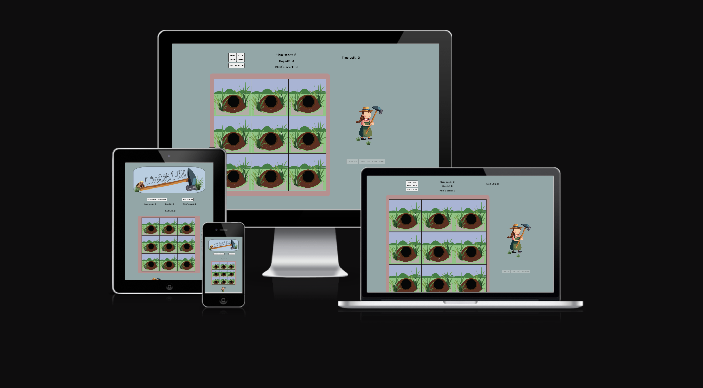
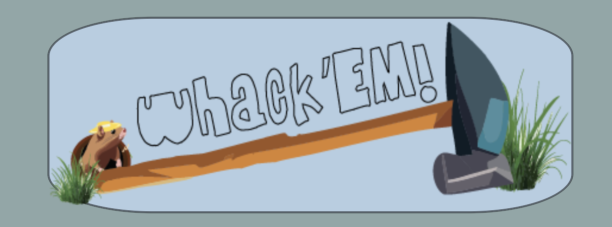
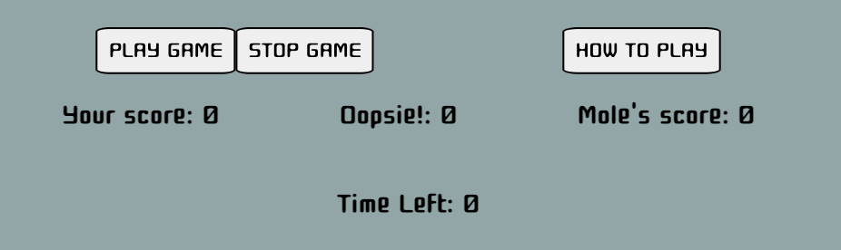
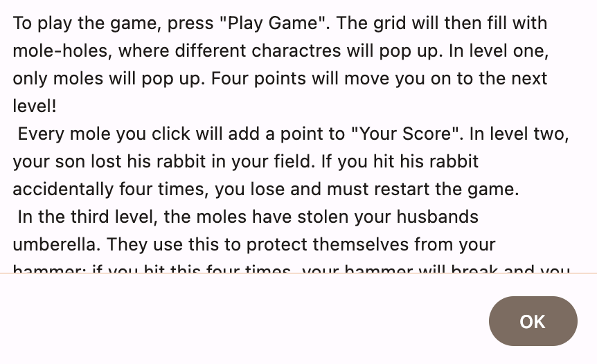
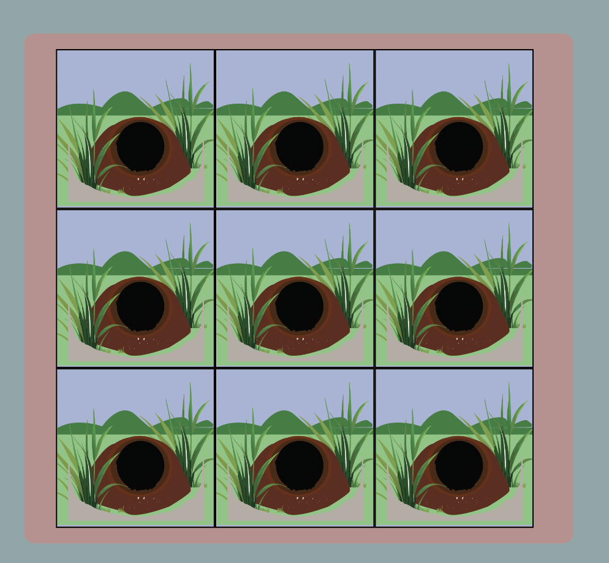
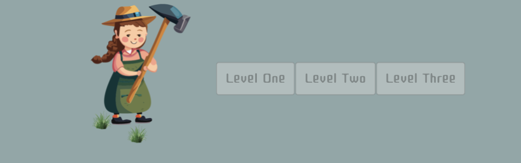
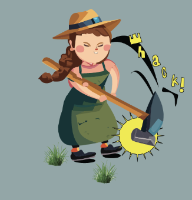
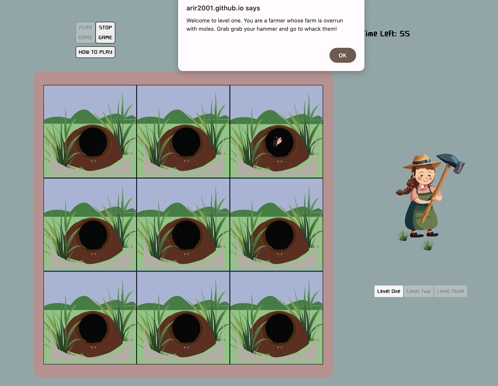
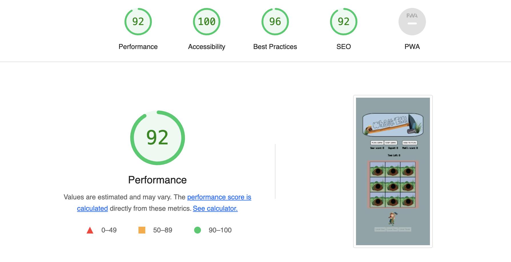

# Whack 'Em!

Whack 'Em is a whack-a-mole game for kids. The site is basic, easy to use and has a soft earthy-toned color palette. 

## Features 

### Existing Features

The top holds the introductory logo: 

Below the logo but above the actual game grid is the buttons. 

There is a start-game button, stop-game button, and how to play button. The how-to-play button opens an alert with the instructions.

The game grid sits below the buttons and displays the pop-up moles, rabbits and moles with umberellas. 

Below that is a cartoon that flips when the moles are clicked to show the farmer hitting the mole.There are also 3 buttons that show what level the player is on.
 

Depending on the screen size, this cartoon moves to the right at larger screen sizes. 

 

If the level button is clicked, more detail about each level is shown. 

## Testing 

### Validator Testing 

## Js Hint:
https://jshint.com/

The warnings for JS were unnecessary, due to differing ECMAScript 6 features and global variables. (source: https://stackoverflow.com/questions/27441803/why-does-jshint-throw-a-warning-if-i-am-using-const , https://stackoverflow.com/questions/17359232/how-to-tell-jshint-to-ignore-all-undefined-variables-in-one-file)

Otherwise, JS was correct. 

## CSS checker:
https://jigsaw.w3.org/css-validator/validator?uri=https%3A%2F%2Farir2001.github.io%2Fwhackamolegame%2F&profile=css3svg&usermedium=all&warning=1&vextwarning=&lang=en

No warnings were found for the CSS.

## HTML checker:
https://validator.w3.org/nu/?showsource=yes&doc=https%3A%2F%2Farir2001.github.io%2Fwhackamolegame%2F

No warnings were found for the HTML.

## Deployment

- The site was deployed to GitHub pages. The steps to deploy are as follows: 
  - In the GitHub repository, navigate to the Settings tab 
  - From the source section drop-down menu, select the Master Branch
  - Once the master branch has been selected, the page will be automatically refreshed with a detailed ribbon display to indicate the successful deployment. 

The live link can be found here - https://arir2001.github.io/whackamolegame/

## Credits 

### Content 

The very basic code 
### Media

- The photos used on the home and sign up page are all from Pexels open source library: https://www.pexels.com/

- The logo waas creaated using AI generator in Adobe Illustrator using a prompt, and then edited to look smoother.

